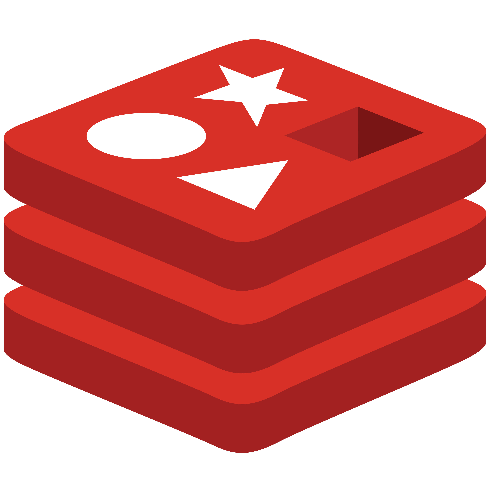
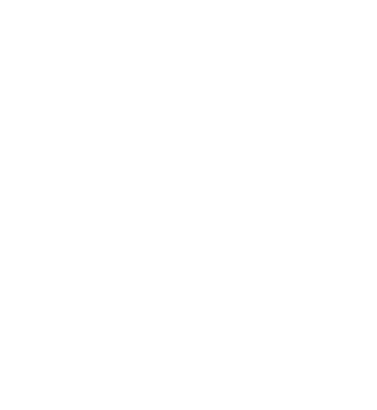

# 🚖 CrossGo

CrossGo is a real-time ride and cargo-matching platform that connects clients with nearby drivers based on availability, vehicle capacity, and trip preferences.

<div style="display: flex; justify-content: space-between; align-items: flex-start;">
  
  
  
</div>

---

## Overview


CrossGo allows customers to request rides or schedule the shipment of goods based on the required weight and volume. Each request includes the client's current location. Simultaneously, drivers can come online and declare their willingness to carry either passengers, goods, or both.


The platform leverages **Redis**, **Kafka**, and **Spring Boot** to implement fast, scalable matchmaking and cache management.

The following are the 4 different services that form this platform:

* [CrossGo-MatchMaking-Service](https://github.com/JConquers/CrossGo-MatchMaking-Service)
* [CrossGo-Driver-Service](https://github.com/JConquers/CrossGo-Driver-Service)
* [CrossGo-Rider-Service](https://github.com/JConquers/CrossGo-Rider-Service)
* [CrossGo-Cargo-Service](https://github.com/JConquers/CrossGo-Cargo-Service/tree/master)

### Redis Caches:

* **C1** – Caches active client (rider/shipment) requests with geo-coordinates and TTL.
* **C2** – Caches online drivers willing to accept ride requests.
* **C3** – Caches online drivers open to carrying cargo.
* **C4** – Utilised by match making service to store intermediary data

### Matchmaking Flow:

1. A client submits a ride or shipment request → stored in **C1** with location and expiry (e.g., *e* minutes).
2. Drivers coming online are geo-indexed into **C2** and **C3**.
3. The matchmaking service reads from **C1** and queries **C2** or **C3** (based on request type) to find the **k-nearest drivers** using Redis Geo queries.
4. Selected drivers have a limited time window to accept the request.

   * If **none** accept: a **Kafka invalidation message** is broadcast to remove the client from **C1**, notifying the client of unavailability.
   * If **accepted**: Kafka invalidation messages are sent to:

     * **C1** – remove the client (match successful)
     * **C2/C3** – remove the driver from availability pools.

This architecture effectively implements **distributed cache invalidation** using Kafka to ensure consistency of availability across microservices and services.

---
## ⚙️ How to run?

* Each of the services run individually. (Here they run on different ports of same machine)
* Ensure needed brokers and servers are run for each service as described in their respective readme
* Client code provided above ```rider_client.py``` provides a CLI to access the services. To run the ```rider_client.py```:
    * Create vitual environment: ```python -m venv env```
    * ```source env/bin/activate```
    * ```pip install -r requirements.txt```
    ```python rider_client.py```


